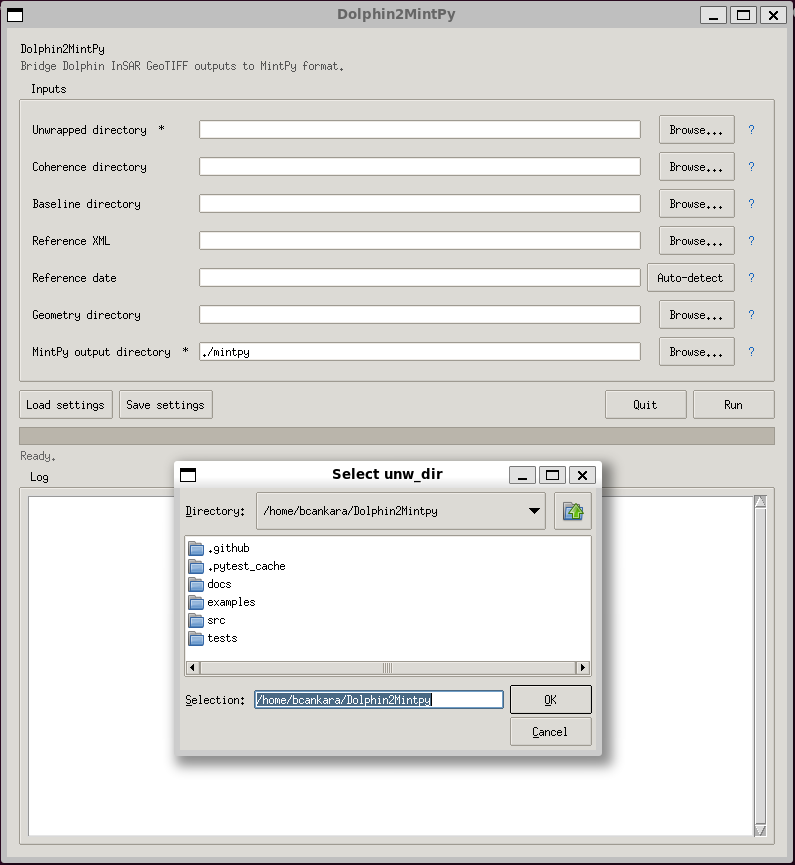

<p align="center">
  
</p>

<h1 align="center">🐬 Dolphin2MintPy</h1>

<p align="center">
  <b>Bridge <a href="https://github.com/opera-adt/dolphin">Dolphin</a> InSAR phase-linking outputs to <a href="https://github.com/insarlab/MintPy">MintPy</a> time-series analysis — with a desktop GUI and a scriptable CLI.</b>
</p>

<p align="center">
  <a href="https://github.com/bcankara/Dolphin2MintPy/actions/workflows/ci.yml"></a>
  <a href="https://opensource.org/licenses/MIT"></a>
  <a href="https://www.python.org/downloads/"></a>
  <a href="#-installation"></a>
  <a href="#-usage"></a>
</p>

---

## 🌊 Where Dolphin2MintPy fits in your pipeline

<p align="center">
  
</p>

<p align="center">
  <b>ISCE2 topsStack</b> → <b>Dolphin</b> (phase linking + SNAPHU) → <b>Dolphin2MintPy</b> <i>(this project)</i> → <b>MintPy</b> time-series analysis
</p>

Dolphin2MintPy is a **metadata translation layer**. It never modifies your rasters — it only writes lightweight ROI_PAC-style `.rsc` sidecar files next to your GeoTIFFs and emits a ready-to-run MintPy `smallbaselineApp.cfg` so the transition from Dolphin to MintPy becomes a one-click step.

---

## ✨ Highlights

|   |   |
|---|---|
| 🖥️ **Desktop GUI**            | Tkinter interface with native file pickers and per-field `?` help tooltips. |
| 🤖 **Smart auto-detection**   | Reference date inferred from the baseline directory with one click.         |
| 🧭 **Radar / geo aware**      | Auto-detects radar vs geocoded stacks; `--geometry-mode` lets you override. |
| 💾 **Persistent settings**    | Paths remembered between runs in `dolphin2mintpy_settings.json`.            |
| ⚡ **Automated `.rsc`**        | Unwrapped, coherence, conncomp, DEM, incidence and azimuth — all covered.  |
| 🌉 **Ready-to-run MintPy cfg**| `PROCESSOR=hyp3` routing with correct glob patterns baked in.               |
| 🛰️ **ISCE2-aware**            | Reads reference XML (wavelength, heading, incidence, PRF) + baselines.      |
| ⚙️ **Scriptable CLI**          | `prepare`, `generate-config`, `info` — HPC- and CI/CD-friendly.             |
| 🧪 **Well-tested**            | GitHub Actions CI across Python 3.9–3.12 with 40+ unit tests.               |

---

## 👀 See it in action

<p align="center">
  
</p>

<p align="center">
  <i>The desktop GUI — native file pickers, per-field tooltips, auto-detect, progress log.</i>
</p>

---

## 🚀 Quick start

```bash
# 1. Install (into any Python 3.9+ environment)
git clone https://github.com/bcankara/Dolphin2MintPy.git
cd Dolphin2MintPy && pip install -e .

# 2. Launch the GUI
dolphin2mintpy

# 3. ... or go straight to the CLI
dolphin2mintpy info --unw-dir ./unwrapped
```

That's it — the GUI opens, you pick your directories, hit **Run**, and MintPy is ready to ingest the stack.

Need more options? Jump to [**Installation**](#-installation) for conda/mamba/venv/pipx recipes.

---

## 📑 Table of Contents

- [Requirements](#-requirements)
- [Installation](#-installation)
  - [A. Install into an existing environment](#a-install-into-an-existing-environment)
  - [B. Create a new environment](#b-create-a-new-environment)
  - [Verify the installation](#verify-the-installation)
- [Usage](#-usage)
  - [Desktop GUI (default)](#1-desktop-gui-default)
  - [Non-interactive CLI](#2-non-interactive-cli)
  - [Geometry mode (radar vs geocoded)](#3-geometry-mode-radar-vs-geocoded)
- [Project layout](#-project-layout)
- [Architecture](#-architecture)
- [Development](#-development)
- [Citation](#-citation)
- [Contributing](#-contributing)
- [License](#-license)
- [Contact](#-contact)

---

## 🧰 Requirements

- **Linux** (tested on Ubuntu / Debian; other distributions should work too).
- **Python 3.9 or newer.**
- **Tkinter** for the GUI. Depending on how your Python was installed, it may need a separate package:

  ```bash
  # Debian / Ubuntu
  sudo apt install python3-tk

  # Fedora / RHEL
  sudo dnf install python3-tkinter

  # Arch
  sudo pacman -S tk

  # conda / mamba environment
  conda install -c conda-forge tk
  ```

- **numpy** (installed automatically by `pip`).

Dolphin2MintPy itself does not depend on GDAL at runtime — only on the Python standard library and `numpy`. GDAL is still needed *downstream* by MintPy when it ingests the rasters, but that is handled by your MintPy installation.

---

## 📦 Installation

Dolphin2MintPy is a pure-Python package, so any standard Python environment manager works. Pick whichever one fits your workflow — the steps below are equivalent.

### A. Install into an existing environment

If you already have a working Python environment for Dolphin, MintPy, or general InSAR work, the simplest option is to add Dolphin2MintPy to it.

```bash
# Activate whichever environment you already use, e.g.:
#   conda activate dolphin
#   mamba activate my-insar-env
#   source ~/.venv/my-insar-env/bin/activate

git clone https://github.com/bcankara/Dolphin2MintPy.git
cd Dolphin2MintPy
pip install -e .
```

Editable mode (`-e`) lets you pull updates with `git pull` without reinstalling. Drop the `-e` for a normal install.

### B. Create a new environment

If you prefer an isolated environment for Dolphin2MintPy, use whichever tool you like.

<details>
<summary><strong>conda / mamba / miniforge</strong></summary>

```bash
conda create -n dolphin2mintpy -c conda-forge python=3.12 numpy tk -y
conda activate dolphin2mintpy

git clone https://github.com/bcankara/Dolphin2MintPy.git
cd Dolphin2MintPy
pip install -e .
```

Swap `conda` for `mamba` if that is what you use — the commands are identical.
</details>

<details>
<summary><strong>Python venv (built-in)</strong></summary>

```bash
# On Debian/Ubuntu, make sure the venv + Tk packages are installed first
sudo apt install python3-venv python3-tk python3-full

python3 -m venv ~/.venv/dolphin2mintpy
source ~/.venv/dolphin2mintpy/bin/activate

git clone https://github.com/bcankara/Dolphin2MintPy.git
cd Dolphin2MintPy
pip install -e .
```
</details>

<details>
<summary><strong>pipx (isolated CLI install)</strong></summary>

```bash
sudo apt install pipx python3-tk
pipx ensurepath

pipx install git+https://github.com/bcankara/Dolphin2MintPy.git
# or from a local checkout:
# pipx install -e ~/Dolphin2MintPy
```
</details>

<details>
<summary><strong>System pip (not recommended on PEP 668 distros)</strong></summary>

```bash
sudo apt install python3-tk
pip install -e . --user        # or add --break-system-packages if needed
```

This path is discouraged on modern Debian/Ubuntu because it can conflict with distro-managed packages. Prefer one of the isolated options above.
</details>

### Verify the installation

```bash
which dolphin2mintpy
dolphin2mintpy --version     # → dolphin2mintpy 0.1.0
dolphin2mintpy --help
```

---

## 🛠️ Usage

### 1. Desktop GUI (default)

Running `dolphin2mintpy` with no arguments opens the graphical interface:

```bash
dolphin2mintpy        # same as: dolphin2mintpy gui
```

| Element                       | What it does                                                                                              |
|-------------------------------|-----------------------------------------------------------------------------------------------------------|
| **Directory / file pickers**  | Browse buttons for every input path (unwrapped, coherence, baseline, reference XML, geometry, output).    |
| **`?` help tooltips**         | Hover the `?` icon next to any field for a plain-English description of that parameter.                   |
| **Auto-detect**               | Infers the reference (super-master) date from the baseline directory automatically.                       |
| **Load / Save settings**      | Persists your paths to `dolphin2mintpy_settings.json` so the form is pre-filled on the next run.          |
| **Progress bar + log**        | Streams real-time output from the generator. The UI stays responsive thanks to a background worker thread.|

### 2. Non-interactive CLI

Perfect for CI/CD pipelines, HPC job scripts, or batch reprocessing:

```bash
# Generate .rsc sidecars for every GeoTIFF in the stack
dolphin2mintpy prepare \
    --unw-dir ./unwrapped \
    --cor-dir ./interferograms \
    --baseline-dir ./baselines \
    --ref-xml ./reference/IW2.xml \
    --ref-date 20240919

# Emit a MintPy smallbaselineApp-compatible config
dolphin2mintpy generate-config \
    --work-dir ./mintpy \
    --unw-dir ./unwrapped

# Inspect a Dolphin stack (file counts, date range, ref date)
dolphin2mintpy info --unw-dir ./unwrapped
```

Full argument reference: `dolphin2mintpy <subcommand> --help`.

### 3. Geometry mode (radar vs geocoded)

MintPy reads a stack as *radar* or *geocoded* depending on whether the `.rsc` sidecars contain `X_FIRST` / `Y_FIRST` / `X_STEP` / `Y_STEP`. Dolphin produces both flavours of GeoTIFF and the two must stay consistent with your geometry files — otherwise MintPy fails later with a cryptic `geometryGeo.h5 not found` (or `geometryRadar.h5 not found`) during `check_loaded_dataset`.

Dolphin2MintPy exposes an explicit **geometry mode** so you can pick the right layout without having to hand-edit every `.rsc`.

| Mode    | When to use                                                                                              |
|---------|----------------------------------------------------------------------------------------------------------|
| `auto`  | **Default.** Inspects the GeoTIFF (projection + geotransform) and decides automatically. Works for 95% of stacks. |
| `radar` | Dolphin GeoTIFFs have no CRS (`Origin=0,0`, `Pixel Size=1,1`) and your geometry files are ISCE2 `*.rdr.full` in radar coordinates. MintPy will produce `geometryRadar.h5`. |
| `geo`   | Dolphin GeoTIFFs carry a real CRS (UTM or EPSG:4326) and your geometry files are georeferenced TIFFs. MintPy will produce `geometryGeo.h5`. |

Quick check with GDAL:

```bash
gdalinfo unwrapped/YYYYMMDD_YYYYMMDD.unw.tif | head -25
# Look for:
#   "Coordinate System is: '' ..."   -> radar geometry (use --geometry-mode radar)
#   "Coordinate System is: PROJCS[...]" / "GEOGCS[...]" + non-zero Origin
#                                     -> geocoded       (auto or --geometry-mode geo)
```

Overriding the detection from the CLI:

```bash
dolphin2mintpy prepare \
    --unw-dir ./unwrapped \
    --cor-dir ./interferograms \
    --geometry-mode radar         # or: auto (default) / geo
```

From the GUI, use the **Geometry mode** drop-down in the Inputs panel. If you ever hit a `geometryGeo.h5` / `geometryRadar.h5` `FileNotFoundError` after `smallbaselineApp.py --dostep load_data`, re-run `dolphin2mintpy` with the opposite mode and regenerate the `.rsc` sidecars — no re-processing of the stack required.

Dolphin2MintPy also logs its decision on startup, so you can verify the mode before MintPy even runs:

```
[INFO] dolphin2mintpy.prepare: Detected geometry: RADAR — auto (no projection and identity geotransform) (override with geometry_mode='radar' or 'geo' if incorrect)
```

---

## 📁 Project layout

```
Dolphin2MintPy/
├── src/dolphin2mintpy/
│   ├── cli.py          Argparse entry point, subcommand dispatch
│   ├── gui.py          Tkinter desktop interface (GUI + tooltips + worker)
│   ├── prepare.py      Core .rsc generation engine
│   ├── metadata.py     ISCE2 XML, GDAL, and baseline parsers
│   ├── config.py       MintPy smallbaselineApp.cfg template generator
│   ├── settings.py     JSON settings persistence (dolphin2mintpy_settings.json)
│   ├── constants.py    Sentinel-1 defaults, RSC templates
│   └── __init__.py     Public API: prepare_rsc, prepare_stack
├── tests/              pytest suite (CLI, metadata, prepare)
├── examples/           Sample configuration and end-to-end workflow
├── docs/
│   ├── architecture.md Module graph and data flow
│   └── images/         Banner, workflow diagram, GUI preview
├── .github/workflows/  CI pipeline (lint + test matrix + build)
├── pyproject.toml      Build system and package metadata
└── README.md
```

---

## 📐 Architecture

For a deep-dive on the module graph and internal data flow — including how ISCE2 XML, baseline directories, and GDAL metadata flow through `metadata.py`, `prepare.py` and `config.py` — see [`docs/architecture.md`](docs/architecture.md).

---

## 🧑‍💻 Development

Clone the repository, activate an isolated environment with the tool of your choice, then install the development extras:

```bash
git clone https://github.com/bcankara/Dolphin2MintPy.git
cd Dolphin2MintPy

# Activate a Python 3.9+ environment, then:
pip install -e ".[dev]"

# Run the test suite
pytest -v

# Lint
ruff check src/ tests/

# Optional: pre-commit hooks
pre-commit install
```

CI runs on GitHub Actions for every push and pull request against `main`, executing `ruff` plus `pytest` across Python 3.9, 3.10, 3.11, and 3.12, and finishes with a package build sanity check. See [`.github/workflows/ci.yml`](.github/workflows/ci.yml).

---

## 📖 Citation

If you use **Dolphin2MintPy** in your research, please cite it to support open science:

```bibtex
@software{dolphin2mintpy,
  author  = {Kara, Burak Can},
  title   = {Dolphin2MintPy: Bridge between Dolphin InSAR and MintPy},
  url     = {https://github.com/bcankara/Dolphin2MintPy},
  version = {0.1.0},
  year    = {2026}
}
```

---

## 🤝 Contributing

Contributions, bug reports and feature requests are very welcome.

1. Open an issue describing the change or bug.
2. Fork the repository and create a feature branch.
3. Follow the coding style enforced by `ruff` and make sure `pytest` passes.
4. Submit a pull request referencing the issue.

See [`docs/architecture.md`](docs/architecture.md) for an overview of the internals before making larger changes.

---

## 📄 License

This project is licensed under the **MIT License** — see the [LICENSE](LICENSE) file for details.

---

## 👤 Contact

<p align="center">
  
</p>

<p align="center">
  <a href="mailto:burakcankara@gmail.com">
    
  </a>
  <a href="https://bcankara.com">
    
  </a>
</p>

<p align="center">
  <a href="https://deformationdb.com">
    
  </a>
  <a href="https://insar.tr">
    
  </a>
</p>

---

<p align="center">
  <sub>🔬 Built for InSAR time series analysis research | © 2026</sub>
</p>
