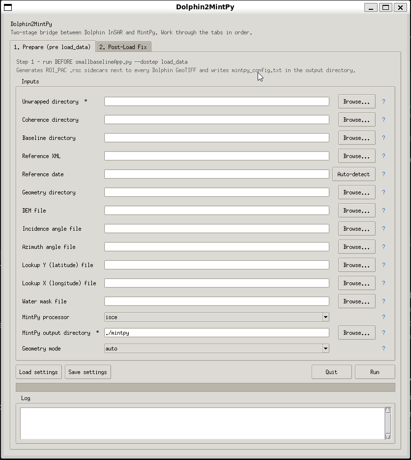
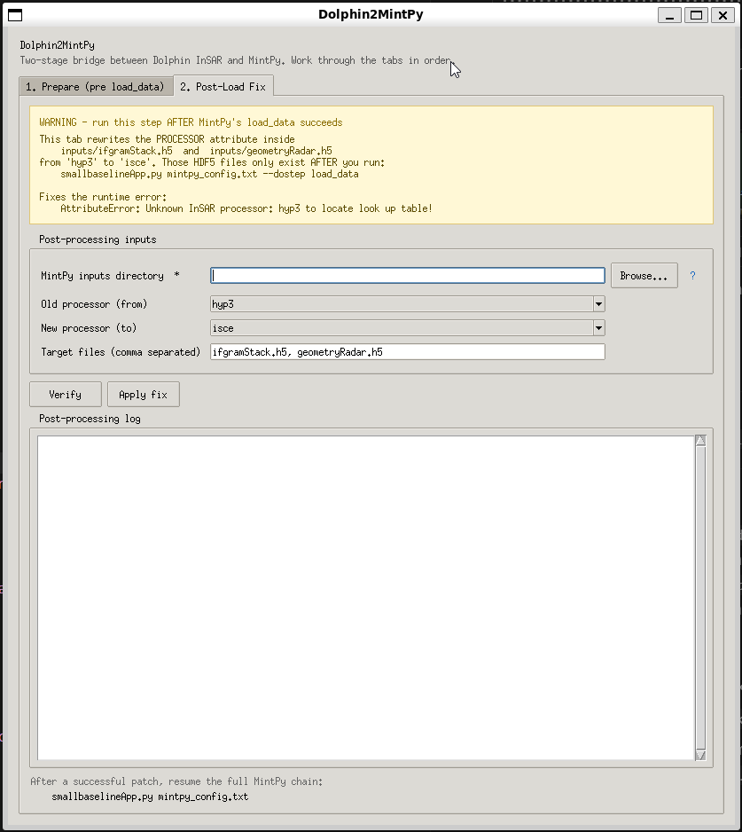

<p align="center">
  
</p>

<h1 align="center">🐬 Dolphin2MintPy</h1>

<p align="center">
  <b>Bridge <a href="https://github.com/opera-adt/dolphin">Dolphin</a> InSAR phase-linking outputs to <a href="https://github.com/insarlab/MintPy">MintPy</a> time-series analysis — with a desktop GUI and a scriptable CLI.</b>
</p>

<p align="center">
  <a href="https://github.com/bcankara/Dolphin2MintPy/actions/workflows/ci.yml"></a>
  <a href="https://opensource.org/licenses/MIT"></a>
  <a href="https://www.python.org/downloads/"></a>
  <a href="#-installation"></a>
  <a href="#-usage"></a>
</p>

---

## 🌊 Where Dolphin2MintPy fits in your pipeline

<p align="center">
  
</p>

<p align="center">
  <b>ISCE2 topsStack</b> → <b>Dolphin</b> (phase linking + SNAPHU) → <b>Dolphin2MintPy · Stage 1 (Prepare)</b> → <b>MintPy <code>load_data</code></b> → <b>Dolphin2MintPy · Stage 2 (Post-Load Fix)</b> → <b>MintPy SBAS chain</b>
</p>

Dolphin2MintPy is a **two-stage metadata translation layer**. It never modifies your rasters. Stage 1 writes lightweight ROI_PAC-style `.rsc` sidecar files next to your GeoTIFFs and emits a ready-to-run MintPy configuration. Stage 2 patches the `PROCESSOR` attribute inside the HDF5 files that MintPy produces during `load_data`, so the rest of the SBAS chain can run unmodified.

---

## ✨ Highlights

|   |   |
|---|---|
| 🖥️ **Desktop GUI**            | Tkinter interface with native file pickers, per-field `?` tooltips, and a two-tab workflow (Prepare → Post-Load Fix). |
| 🧪 **Post-load HDF5 fix**     | Dedicated Tab 2 / `fix-processor` CLI patches the `PROCESSOR` attribute (`hyp3 → isce`) on `ifgramStack.h5` + `geometryRadar.h5` after MintPy's `load_data` step. |
| 🤖 **Smart auto-detection**   | Reference date inferred from the baseline directory with one click.         |
| 🧭 **Radar / geo aware**      | Auto-detects radar vs geocoded stacks; `--geometry-mode` lets you override. |
| 💾 **Persistent settings**    | Paths remembered between runs in `dolphin2mintpy_settings.json`.            |
| ⚡ **Automated `.rsc`**        | Unwrapped, coherence, conncomp, DEM, incidence and azimuth — all covered.  |
| 🌉 **Ready-to-run MintPy cfg**| Emits `demFile`, `incAngleFile`, `azAngleFile`, `lookupYFile`, `lookupXFile`, `waterMaskFile`, `networkInversion.*` and reference point — no hand-editing needed. |
| 🔍 **Geometry auto-fill**     | Selecting the geometry directory auto-fills DEM / lookup file paths (`hgt.rdr.full`, `los.rdr.full`, `lat.rdr.full`, `lon.rdr.full`). |
| 🛰️ **ISCE2-aware**            | Reads reference XML (wavelength, heading, incidence, PRF, sensing times) + baselines. |
| ⏱️ **Tropo & geocode ready**   | Writes numeric `HEADING`, `CENTER_LINE_UTC`, `startUTC`, `stopUTC` into every `.rsc` so MintPy's `correct_troposphere` (pyaps3 / ERA5) and `geocode` steps run without hand-patching HDF5 metadata later. |
| ⚙️ **Scriptable CLI**          | `prepare`, `generate-config`, `info` — HPC- and CI/CD-friendly.             |
| 🧪 **Well-tested**            | GitHub Actions CI across Python 3.9–3.12 with 40+ unit tests.               |

---

## 👀 See it in action

The desktop GUI follows the two-stage workflow: **Tab 1** prepares everything MintPy's `load_data` step needs, **Tab 2** patches the HDF5 stack MintPy just produced so the rest of the SBAS chain can run.

<table>
<tr>
<td align="center" width="50%">
  <br>
  <b>Tab 1 · Prepare (pre <code>load_data</code>)</b>
</td>
<td align="center" width="50%">
  <br>
  <b>Tab 2 · Post-Load Fix</b>
</td>
</tr>
</table>

### 🗂️ Tab 1 · Prepare (pre `load_data`) — what it does

Run this **before** calling `smallbaselineApp.py --dostep load_data`. Fill in every path that points at your Dolphin outputs and ISCE2 topsStack geometry, then press **Run**. The tab does two things in a single background-worker pass:

1. **Writes an ROI_PAC `.rsc` sidecar next to every GeoTIFF** in the unwrapped / coherence / conncomp directories, so MintPy can discover `DATE12`, `P_BASELINE_TOP_HDR`, `WAVELENGTH`, `RANGE_PIXEL_SIZE`, etc. without running `prep_isce.py`.
2. **Generates `mintpy_config.txt`** in the MintPy output directory, pre-populated with the processor, geometry files, lookup tables and network-inversion defaults that match a hybrid ISCE2/Dolphin stack.

| Field                          | What it maps to                                                                          |
|--------------------------------|------------------------------------------------------------------------------------------|
| **Unwrapped / Coherence / Baseline / Reference XML / Reference date** | Inputs for `.rsc` generation (date pairs, baselines, radar parameters). |
| **Geometry directory**         | Optional convenience — auto-fills the six file fields below from an ISCE2 `geom_reference/` folder. |
| **DEM file**                   | `mintpy.load.demFile` (typically `hgt.rdr.full`).                                         |
| **Incidence / Azimuth angle**  | `mintpy.load.incAngleFile` / `azAngleFile` (typically `los.rdr.full`).                    |
| **Lookup Y (latitude) file**   | `mintpy.load.lookupYFile` — required so MintPy can geocode later (`lat.rdr.full`).        |
| **Lookup X (longitude) file**  | `mintpy.load.lookupXFile` — required so MintPy can geocode later (`lon.rdr.full`).        |
| **Water mask file**            | `mintpy.load.waterMaskFile` (optional).                                                   |
| **MintPy processor**           | Value written to `mintpy.load.processor` (`isce` for hybrid stacks, `hyp3` for fully geocoded HyP3 products). |
| **MintPy output directory**    | Where `mintpy_config.txt` is written.                                                     |
| **Geometry mode**              | `auto` / `radar` / `geo` — forces the layout of `.rsc` sidecars when auto-detection gets it wrong. |

> Use the `Load settings` / `Save settings` buttons to persist every path in `dolphin2mintpy_settings.json` so the form reopens pre-filled next time.

### 🧪 Tab 2 · Post-Load Fix — what it does

Run this **after** `smallbaselineApp.py mintpy_config.txt --dostep load_data` has finished and produced `inputs/ifgramStack.h5` + `inputs/geometryRadar.h5`. The yellow warning banner at the top of the tab exists to keep you from running it too early.

The problem this tab solves is very specific: during `load_data`, MintPy needs `PROCESSOR=hyp3` on the Dolphin GeoTIFFs so it uses its GDAL reader (the ISCE path would try a raw-binary read and fail on LZW-compressed TIFFs). But once the HDF5 files exist, `check_loaded_dataset()` re-interprets the same `hyp3` label as "geocoded" and refuses to look up `/latitude` + `/longitude`, raising:

    AttributeError: Unknown InSAR processor: hyp3 to locate look up table!

Tab 2 fixes this by rewriting the HDF5 `PROCESSOR` (and `INSAR_PROCESSOR`) attributes from `hyp3` to `isce` on the already-loaded stack — no rasters are re-processed, the patch takes well under a second.

| Field                          | What it does                                                                              |
|--------------------------------|-------------------------------------------------------------------------------------------|
| **MintPy inputs directory**    | The `inputs/` folder produced by `load_data` (e.g. `.../tubitak3501_merzifon/inputs`).    |
| **Old processor (from)**       | Current value to replace. Default: `hyp3`.                                                |
| **New processor (to)**         | Replacement value. Default: `isce`.                                                       |
| **Target files**               | Comma-separated HDF5 file list. Default: `ifgramStack.h5, geometryRadar.h5`.              |

| Button                         | What it does                                                                              |
|--------------------------------|-------------------------------------------------------------------------------------------|
| **Verify**                     | Read-only inspection: prints current `PROCESSOR` values and checks that `/latitude` + `/longitude` datasets exist in `geometryRadar.h5`. |
| **Apply fix**                  | Rewrites the HDF5 attributes. Refuses to run if the lookup datasets are missing (delete `geometryRadar.h5` and re-run `load_data` first). |

After a successful patch, resume the full SBAS chain with `smallbaselineApp.py mintpy_config.txt` as usual.

---

## 🚀 Quick start

```bash
# 1. Install (into any Python 3.9+ environment)
git clone https://github.com/bcankara/Dolphin2MintPy.git
cd Dolphin2MintPy && pip install -e .

# 2. Launch the GUI
dolphin2mintpy

# 3. ... or go straight to the CLI
dolphin2mintpy info --unw-dir ./unwrapped
```

That's it — the GUI opens, you pick your directories, hit **Run**, and MintPy is ready to ingest the stack.

Need more options? Jump to [**Installation**](#-installation) for conda/mamba/venv/pipx recipes.

---

## 📑 Table of Contents

- [Requirements](#-requirements)
- [Installation](#-installation)
  - [A. Install into an existing environment](#a-install-into-an-existing-environment)
  - [B. Create a new environment](#b-create-a-new-environment)
  - [Verify the installation](#verify-the-installation)
- [Usage](#-usage)
  - [Desktop GUI (default)](#1-desktop-gui-default)
  - [Non-interactive CLI](#2-non-interactive-cli)
  - [Geometry mode (radar vs geocoded)](#3-geometry-mode-radar-vs-geocoded)
- [Project layout](#-project-layout)
- [Architecture](#-architecture)
- [Development](#-development)
- [Citation](#-citation)
- [Contributing](#-contributing)
- [License](#-license)
- [Contact](#-contact)

---

## 🧰 Requirements

- **Linux** (tested on Ubuntu / Debian; other distributions should work too).
- **Python 3.9 or newer.**
- **Tkinter** for the GUI. Depending on how your Python was installed, it may need a separate package:

  ```bash
  # Debian / Ubuntu
  sudo apt install python3-tk

  # Fedora / RHEL
  sudo dnf install python3-tkinter

  # Arch
  sudo pacman -S tk

  # conda / mamba environment
  conda install -c conda-forge tk
  ```

- **numpy** (installed automatically by `pip`).

Dolphin2MintPy itself does not depend on GDAL at runtime — only on the Python standard library and `numpy`. GDAL is still needed *downstream* by MintPy when it ingests the rasters, but that is handled by your MintPy installation.

---

## 📦 Installation

Dolphin2MintPy is a pure-Python package, so any standard Python environment manager works. Pick whichever one fits your workflow — the steps below are equivalent.

### A. Install into an existing environment

If you already have a working Python environment for Dolphin, MintPy, or general InSAR work, the simplest option is to add Dolphin2MintPy to it.

```bash
# Activate whichever environment you already use, e.g.:
#   conda activate dolphin
#   mamba activate my-insar-env
#   source ~/.venv/my-insar-env/bin/activate

git clone https://github.com/bcankara/Dolphin2MintPy.git
cd Dolphin2MintPy
pip install -e .
```

Editable mode (`-e`) lets you pull updates with `git pull` without reinstalling. Drop the `-e` for a normal install.

### B. Create a new environment

If you prefer an isolated environment for Dolphin2MintPy, use whichever tool you like.

<details>
<summary><strong>conda / mamba / miniforge</strong></summary>

```bash
conda create -n dolphin2mintpy -c conda-forge python=3.12 numpy tk -y
conda activate dolphin2mintpy

git clone https://github.com/bcankara/Dolphin2MintPy.git
cd Dolphin2MintPy
pip install -e .
```

Swap `conda` for `mamba` if that is what you use — the commands are identical.
</details>

<details>
<summary><strong>Python venv (built-in)</strong></summary>

```bash
# On Debian/Ubuntu, make sure the venv + Tk packages are installed first
sudo apt install python3-venv python3-tk python3-full

python3 -m venv ~/.venv/dolphin2mintpy
source ~/.venv/dolphin2mintpy/bin/activate

git clone https://github.com/bcankara/Dolphin2MintPy.git
cd Dolphin2MintPy
pip install -e .
```
</details>

<details>
<summary><strong>pipx (isolated CLI install)</strong></summary>

```bash
sudo apt install pipx python3-tk
pipx ensurepath

pipx install git+https://github.com/bcankara/Dolphin2MintPy.git
# or from a local checkout:
# pipx install -e ~/Dolphin2MintPy
```
</details>

<details>
<summary><strong>System pip (not recommended on PEP 668 distros)</strong></summary>

```bash
sudo apt install python3-tk
pip install -e . --user        # or add --break-system-packages if needed
```

This path is discouraged on modern Debian/Ubuntu because it can conflict with distro-managed packages. Prefer one of the isolated options above.
</details>

### Verify the installation

```bash
which dolphin2mintpy
dolphin2mintpy --version     # → dolphin2mintpy 0.1.0
dolphin2mintpy --help
```

---

## 🛠️ Usage

### 🧭 Two-stage workflow at a glance

Dolphin2MintPy is intentionally split into **two stages** because the MintPy pipeline needs different metadata at different moments. Run each stage at the indicated point — mixing the order reproduces the exact runtime errors you are trying to avoid.

| Stage | When to run                                                                 | What it does                                                                            | Command / UI                                                                                       |
|-------|-----------------------------------------------------------------------------|-----------------------------------------------------------------------------------------|-----------------------------------------------------------------------------------------------------|
| **1** | Right after Dolphin + SNAPHU produce the interferograms, **before** MintPy. | Generates `.rsc` sidecars next to every GeoTIFF and writes `mintpy_config.txt`.         | GUI tab `1. Prepare` · CLI `dolphin2mintpy prepare` + `dolphin2mintpy generate-config`              |
| **–** | MintPy itself.                                                              | Loads the stack into `inputs/ifgramStack.h5` and `inputs/geometryRadar.h5`.            | `smallbaselineApp.py mintpy_config.txt --dostep load_data`                                          |
| **2** | **After** `load_data` succeeds, **before** any other MintPy step.           | Patches `PROCESSOR` (`hyp3 → isce`) inside the two HDF5 files so MintPy's lookup logic accepts them. | GUI tab `2. Post-Load Fix` · CLI `dolphin2mintpy fix-processor --inputs-dir ./inputs`               |
| **–** | MintPy itself.                                                              | Resumes the full SBAS chain (`modify_network` → `velocity` → `geocode`).                | `smallbaselineApp.py mintpy_config.txt`                                                             |

> Why two stages? During `load_data`, MintPy must use its **GDAL reader** to decompress Dolphin's LZW-compressed GeoTIFFs — that is triggered by `PROCESSOR=hyp3`. But once the stack is loaded, `check_loaded_dataset()` re-uses the same label to pick a lookup-table search strategy, and `hyp3` assumes geocoded data. Flipping the label to `isce` after loading is what unlocks the radar-geometry lookup path (`/latitude` + `/longitude`).

### 1. Desktop GUI (default)

Running `dolphin2mintpy` with no arguments opens the graphical interface:

```bash
dolphin2mintpy        # same as: dolphin2mintpy gui
```

The window is organised as a **two-tab notebook** that mirrors the workflow above:

| Tab                      | Purpose                                                                                                        |
|--------------------------|----------------------------------------------------------------------------------------------------------------|
| **1. Prepare**           | All Dolphin → MintPy pre-`load_data` inputs: unwrapped / coherence / conncomp directories, baselines, reference XML, geometry files, lookup tables, MintPy output directory, geometry mode. Writes `.rsc` sidecars and `mintpy_config.txt`. |
| **2. Post-Load Fix**     | Select the MintPy `inputs/` directory produced by `load_data`, press **Verify** to inspect the current `PROCESSOR` value, then **Apply fix** to rewrite `hyp3 → isce` on `ifgramStack.h5` and `geometryRadar.h5`. A verification step refuses to run if `/latitude` or `/longitude` datasets are missing from `geometryRadar.h5`. |

Common UI helpers apply to both tabs:

| Element                       | What it does                                                                                              |
|-------------------------------|-----------------------------------------------------------------------------------------------------------|
| **Directory / file pickers**  | Browse buttons for every input path (unwrapped, coherence, baseline, reference XML, geometry, output).    |
| **`?` help tooltips**         | Hover the `?` icon next to any field for a plain-English description of that parameter.                   |
| **Auto-detect**               | Infers the reference (super-master) date from the baseline directory automatically.                       |
| **Load / Save settings**      | Persists your paths to `dolphin2mintpy_settings.json` so the form is pre-filled on the next run.          |
| **Progress bar + log**        | Streams real-time output from the generator. The UI stays responsive thanks to a background worker thread.|

### 2. Non-interactive CLI

Perfect for CI/CD pipelines, HPC job scripts, or batch reprocessing:

```bash
# Generate .rsc sidecars for every GeoTIFF in the stack
dolphin2mintpy prepare \
    --unw-dir ./unwrapped \
    --cor-dir ./interferograms \
    --baseline-dir ./baselines \
    --ref-xml ./reference/IW2.xml \
    --ref-date 20240919

# Emit a MintPy smallbaselineApp-compatible config
# (pass the lookup tables so MintPy can geocode the radar-geometry results)
dolphin2mintpy generate-config \
    --work-dir ./mintpy \
    --unw-dir ./unwrapped \
    --dem-file /path/to/geom_reference/hgt.rdr.full \
    --inc-angle-file /path/to/geom_reference/los.rdr.full \
    --az-angle-file /path/to/geom_reference/los.rdr.full \
    --lookup-y-file /path/to/geom_reference/lat.rdr.full \
    --lookup-x-file /path/to/geom_reference/lon.rdr.full \
    --processor isce

# Inspect a Dolphin stack (file counts, date range, ref date)
dolphin2mintpy info --unw-dir ./unwrapped

# ---------- Now run MintPy's load_data step ----------
#   smallbaselineApp.py mintpy_config.txt --dostep load_data
#
# ---------- Then patch the HDF5 PROCESSOR attribute ----------
# Verify first (read-only):
dolphin2mintpy fix-processor \
    --inputs-dir ./mintpy/inputs \
    --verify-only

# Apply the hyp3 -> isce patch on ifgramStack.h5 + geometryRadar.h5
dolphin2mintpy fix-processor \
    --inputs-dir ./mintpy/inputs

# Finally run the full SBAS chain:
#   smallbaselineApp.py mintpy_config.txt
```

Full argument reference: `dolphin2mintpy <subcommand> --help`.

### 3. Geometry mode (radar vs geocoded)

MintPy reads a stack as *radar* or *geocoded* depending on whether the `.rsc` sidecars contain `X_FIRST` / `Y_FIRST` / `X_STEP` / `Y_STEP`. Dolphin produces both flavours of GeoTIFF and the two must stay consistent with your geometry files — otherwise MintPy fails later with a cryptic `geometryGeo.h5 not found` (or `geometryRadar.h5 not found`) during `check_loaded_dataset`.

Dolphin2MintPy exposes an explicit **geometry mode** so you can pick the right layout without having to hand-edit every `.rsc`.

| Mode    | When to use                                                                                              |
|---------|----------------------------------------------------------------------------------------------------------|
| `auto`  | **Default.** Inspects the GeoTIFF (projection + geotransform) and decides automatically. Works for 95% of stacks. |
| `radar` | Dolphin GeoTIFFs have no CRS (`Origin=0,0`, `Pixel Size=1,1`) and your geometry files are ISCE2 `*.rdr.full` in radar coordinates. MintPy will produce `geometryRadar.h5`. |
| `geo`   | Dolphin GeoTIFFs carry a real CRS (UTM or EPSG:4326) and your geometry files are georeferenced TIFFs. MintPy will produce `geometryGeo.h5`. |

Quick check with GDAL:

```bash
gdalinfo unwrapped/YYYYMMDD_YYYYMMDD.unw.tif | head -25
# Look for:
#   "Coordinate System is: '' ..."   -> radar geometry (use --geometry-mode radar)
#   "Coordinate System is: PROJCS[...]" / "GEOGCS[...]" + non-zero Origin
#                                     -> geocoded       (auto or --geometry-mode geo)
```

Overriding the detection from the CLI:

```bash
dolphin2mintpy prepare \
    --unw-dir ./unwrapped \
    --cor-dir ./interferograms \
    --geometry-mode radar         # or: auto (default) / geo
```

From the GUI, use the **Geometry mode** drop-down in the Inputs panel. If you ever hit a `geometryGeo.h5` / `geometryRadar.h5` `FileNotFoundError` after `smallbaselineApp.py --dostep load_data`, re-run `dolphin2mintpy` with the opposite mode and regenerate the `.rsc` sidecars — no re-processing of the stack required.

Dolphin2MintPy also logs its decision on startup, so you can verify the mode before MintPy even runs:

```
[INFO] dolphin2mintpy.prepare: Detected geometry: RADAR — auto (no projection and identity geotransform) (override with geometry_mode='radar' or 'geo' if incorrect)
```

### 4. The classic MintPy failures — and which field / command fixes each

When Dolphin's GeoTIFF outputs are combined with ISCE2 topsStack geometry files, a handful of MintPy errors tend to surface one after another — at `load_data`, then again during `correct_troposphere` and `geocode`. Dolphin2MintPy addresses each one explicitly:

| #  | MintPy error                                                         | When it happens          | Root cause                                                                         | Where to fix                                                                 |
|----|----------------------------------------------------------------------|--------------------------|------------------------------------------------------------------------------------|------------------------------------------------------------------------------|
| 1  | `KeyError: 'DATE12'`                                                 | during `load_data`       | MintPy could not build ROI_PAC metadata from Dolphin TIFFs.                        | **Tab 1 / prepare** — `.rsc` sidecars with `DATE12` + `P_BASELINE_TOP_HDR`.   |
| 2  | `ValueError: cannot reshape array of size ...`                       | during `load_data`       | `PROCESSOR=isce` forced a raw-binary read of a compressed GeoTIFF.                 | **Tab 1 / prepare** — `.rsc` writes `PROCESSOR=hyp3` to use GDAL.             |
| 3  | `FileNotFoundError: inputs/geometryGeo.h5`                           | during `load_data`       | `Y_FIRST`/`X_FIRST=0` flagged the stack as geocoded although it was radar geometry.| **Tab 1 / prepare** — `Geometry mode = radar` (GUI) / `--geometry-mode radar`.|
| 4  | `FileNotFoundError: No lookup table (longitude or rangeCoord) found` | during `load_data`       | Missing `latitude` / `longitude` lookup paths in the MintPy config.                | **Tab 1 / prepare** — Lookup Y (`lat.rdr.full`) + Lookup X (`lon.rdr.full`).  |
| 5  | `AttributeError: Unknown InSAR processor: hyp3 to locate look up table!` | **AFTER** `load_data`    | The `PROCESSOR=hyp3` label needed for GDAL ingest now breaks `check_loaded_dataset()`. | **Tab 2 / Post-Load Fix** — `dolphin2mintpy fix-processor --inputs-dir ./inputs`. |
| 6  | `KeyError: 'CENTER_LINE_UTC'` / pyaps3 ERA5 hour mismatch            | during `correct_troposphere` | ISCE2 topsStack XMLs do not expose `CENTER_LINE_UTC`, so MintPy cannot pick the right ERA5 hour. | **Tab 1 / prepare** — `.rsc` derives `CENTER_LINE_UTC` from `sensingStart` / `sensingStop` in the reference XML. |
| 7  | `AttributeError: HEADING` / pyresample `radius_of_influence=0`       | during `geocode`         | Numeric scene heading missing from the HDF5 metadata.                              | **Tab 1 / prepare** — `.rsc` always writes numeric `HEADING` (nominal S1 value from `passDirection`, or the XML value when present). |

Point the **Geometry directory** field at the ISCE2 `geom_reference/` folder and the GUI auto-fills the DEM, incidence, azimuth and lookup file paths for you. From the CLI, pass the six paths explicitly to `generate-config` (see the example above).

> Errors #1–#4, #6 and #7 are caught by **Tab 1 (Prepare)** — all seven values are written into the `.rsc` sidecars and MintPy's `load_data` step propagates them straight into `ifgramStack.h5` / `geometryRadar.h5` / `timeseries.h5`. Error #5 is caught by **Tab 2 (Post-Load Fix)**. Tab 2 is a lightweight HDF5 patch — no rasters are re-processed and the step takes well under a second.

---

## 📁 Project layout

```
Dolphin2MintPy/
├── src/dolphin2mintpy/
│   ├── cli.py          Argparse entry point (prepare, generate-config, fix-processor, info)
│   ├── gui.py          Tkinter desktop interface (two-tab notebook + worker)
│   ├── prepare.py      Core .rsc generation engine (Stage 1)
│   ├── postprocess.py  Post-load HDF5 PROCESSOR patcher (Stage 2)
│   ├── metadata.py     ISCE2 XML, GDAL, and baseline parsers
│   ├── config.py       MintPy smallbaselineApp.cfg template generator
│   ├── settings.py     JSON settings persistence (dolphin2mintpy_settings.json)
│   ├── constants.py    Sentinel-1 defaults, RSC templates
│   └── __init__.py     Public API: prepare_rsc, prepare_stack, fix_processor_attribute
├── tests/              pytest suite (CLI, metadata, prepare)
├── examples/           Sample configuration and end-to-end workflow
├── docs/
│   ├── architecture.md Module graph and data flow
│   └── images/         Banner, workflow diagram, GUI preview
├── .github/workflows/  CI pipeline (lint + test matrix + build)
├── pyproject.toml      Build system and package metadata
└── README.md
```

---

## 📐 Architecture

For a deep-dive on the module graph and internal data flow — including how ISCE2 XML, baseline directories, and GDAL metadata flow through `metadata.py`, `prepare.py` and `config.py` — see [`docs/architecture.md`](docs/architecture.md).

---

## 🧑‍💻 Development

Clone the repository, activate an isolated environment with the tool of your choice, then install the development extras:

```bash
git clone https://github.com/bcankara/Dolphin2MintPy.git
cd Dolphin2MintPy

# Activate a Python 3.9+ environment, then:
pip install -e ".[dev]"

# Run the test suite
pytest -v

# Lint
ruff check src/ tests/

# Optional: pre-commit hooks
pre-commit install
```

CI runs on GitHub Actions for every push and pull request against `main`, executing `ruff` plus `pytest` across Python 3.9, 3.10, 3.11, and 3.12, and finishes with a package build sanity check. See [`.github/workflows/ci.yml`](.github/workflows/ci.yml).

---

## 📖 Citation

If you use **Dolphin2MintPy** in your research, please cite it to support open science:

```bibtex
@software{dolphin2mintpy,
  author  = {Kara, Burak Can},
  title   = {Dolphin2MintPy: Bridge between Dolphin InSAR and MintPy},
  url     = {https://github.com/bcankara/Dolphin2MintPy},
  version = {0.1.0},
  year    = {2026}
}
```

---

## 🤝 Contributing

Contributions, bug reports and feature requests are very welcome.

1. Open an issue describing the change or bug.
2. Fork the repository and create a feature branch.
3. Follow the coding style enforced by `ruff` and make sure `pytest` passes.
4. Submit a pull request referencing the issue.

See [`docs/architecture.md`](docs/architecture.md) for an overview of the internals before making larger changes.

---

## 📄 License

This project is licensed under the **MIT License** — see the [LICENSE](LICENSE) file for details.

---

## 👤 Contact

<p align="center">
  
</p>

<p align="center">
  <a href="mailto:burakcankara@gmail.com">
    
  </a>
  <a href="https://bcankara.com">
    
  </a>
</p>

<p align="center">
  <a href="https://deformationdb.com">
    
  </a>
  <a href="https://insar.tr">
    
  </a>
</p>

---

<p align="center">
  <sub>🔬 Built for InSAR time series analysis research | © 2026</sub>
</p>
